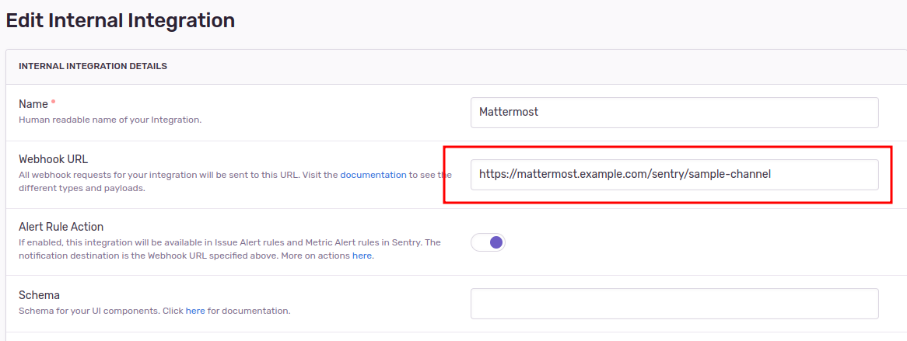

# sentry-mattermost-integration

This is a fork of [sentry-mattermost-sidecar](https://github.com/Its-Alex/sentry-mattermost-sidecar) designed to work with Sentry's newer internal integrations rather than its legacy webhooks.

Events handled

- [x] Bug alert triggered
- [ ] Issue created
- [ ] Issue resolved

## How to use

1. Create a [Mattermost incoming webhook](https://docs.mattermost.com/developer/webhooks-incoming.html) integration.

    

2. Deploy the [docker image](https://hub.docker.com/r/itsalex/sentry-mattermost-sidecar) and specify your Mattermost web hook URL in the `SMS_MATTERMOST_WEBHOOK_URL` environment variable

3. Create a Sentry integration which points to your deployment, including a channel slug to post to.

    

4. Set up [sentry issue alerts](https://docs.sentry.io/product/alerts/) as you like.

    

## Deploy

This image is automatically deployed and versionned as a docker image at [cheald/sentry-mattermost-integration](https://hub.docker.com/r/cheald/sentry-mattermost-integration).
